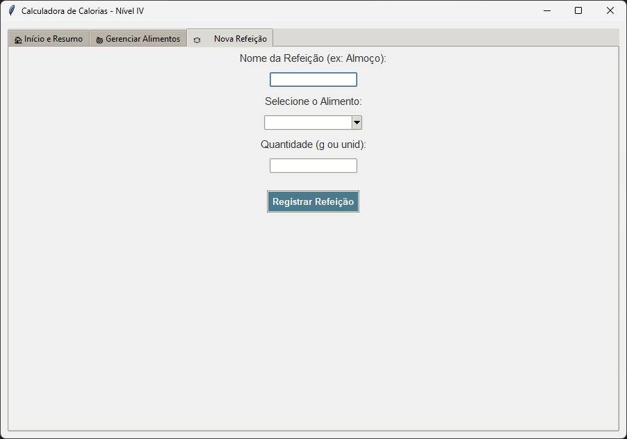
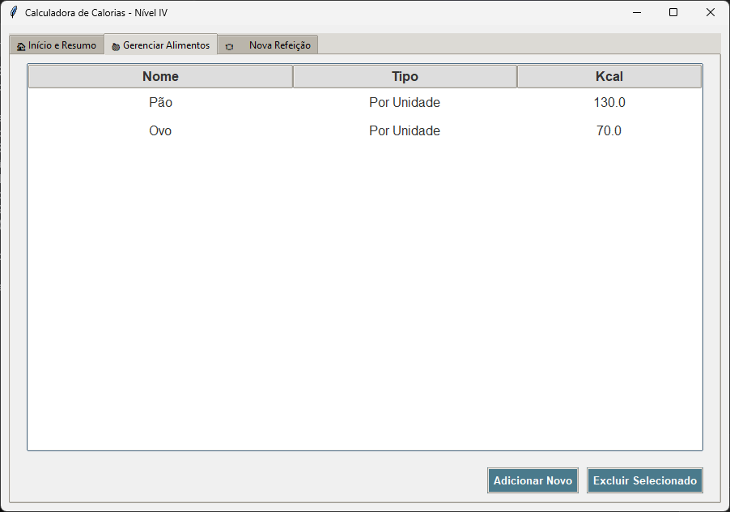
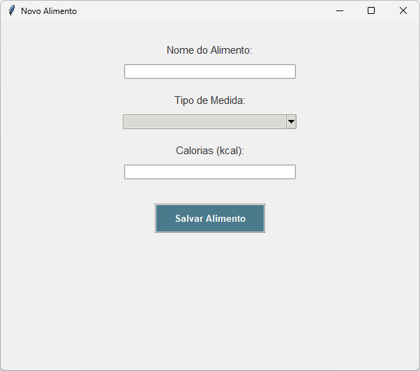

# Calculadora de Calorias

Projeto desenvolvido para a disciplina de Programação Orientada a Objetos no curso de Engenharia de Software da Universidade de Brasília.

A aplicação permite cadastrar alimentos, registrar refeições e acompanhar o consumo diário de calorias em relação a uma meta definida pelo usuário.

## Funcionalidades

* Definição de meta diária de calorias
* Cadastro de alimentos
* Registro de refeições
* Cálculo automático de calorias consumidas
* Visualização de resumo diário

## Tecnologias utilizadas

* Python
* JSON para armazenamento de dados
* Programação Orientada a Objetos
* Interface gráfica com Tkinter

## Interface da aplicação

### Tela inicial / resumo do dia

Permite definir uma meta diária de calorias e visualizar o resumo do consumo.



### Gerenciamento de alimentos

Tela para cadastrar, editar e visualizar alimentos disponíveis no sistema.



### Registro de refeição

Permite registrar uma nova refeição com os alimentos cadastrados.


### Cadastro de novo alimento

Tela utilizada para adicionar novos alimentos à base de dados.



## Estrutura do projeto

```
projeto-calculadora
│
├── gui.py           # Interface gráfica
├── modelos.py       # Lógica e modelos de dados
├── alimentos.json   # Base de dados
├── testbench.py     # Testes
└── images           # Imagens do README
```

## Como executar o projeto

Clone o repositório:

git clone https://github.com/alice-mariano/projeto-calculadora.git

Entre na pasta do projeto:

cd projeto-calculadora

Execute o programa:

python gui.py

## Objetivo acadêmico

Este projeto foi desenvolvido para aplicar conceitos de:

* Programação Orientada a Objetos
* Organização de código
* Manipulação de arquivos
* Desenvolvimento de interfaces gráficas
